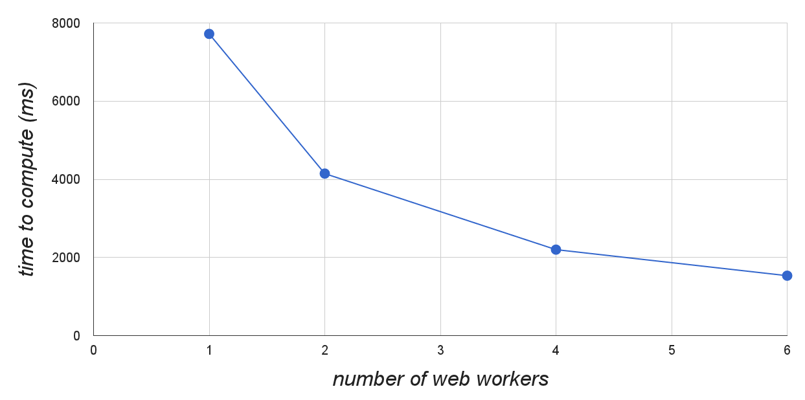
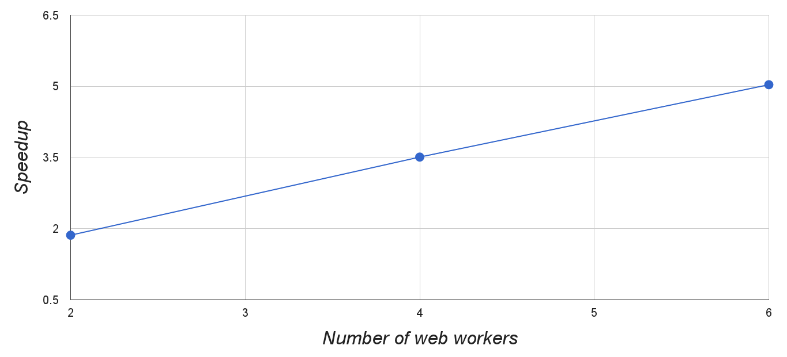

# Final Write Up #

## Summary ##

This project is an attempt to add as many user friendly data parallel
programming constructs to javascript as possible. We were able to achieve
multithreading and OpenMP style annotations in javascript.

## Background ##

Javascript has become a dominant language used on the web. However, javascript
is inherently a single threaded programming language. It gets around this
problem by using asynchronous callbacks, but this only hides the problem. This
project is an attempt at actually solving this problem by providing data
parallel programming constructs to javascript.

To do this, we first employ web workers. With web workers we were able to create
a general purpose threading library. And to support annotations, we changed
Mozilla's javascript engine, Spidermonkey. This is done by changing the way
Spidermonkey parses javascript files.

## Approach - Threads ##

The simplest form of parallel programming are threads. Javascript wasn't able to
spawn separate threads until recently when web workers were introduced with the
release of
[HTML 5](https://developer.mozilla.org/en-US/docs/Web/Guide/Performance/Using_web_workers){:target="_blank"}.

But the problem was that their usage wasn't as straightforward as spawning a
thread by calling a function such as `spawn_thread`. In fact, using web workers
is rather convoluted and has a lot of restrictions.

#### Web Workers ####

The first restriction of web workers is that to spawn them, you don't pass in a
function pointer like you do with `pthread_create`. Instead, they need to be
directed to an entire javascript file which they run. This means that
multithreading with just web workers leads to a separate javascript file for
each operation being carried out by a thread.

Related to the first restriction, web workers execute in a logically separate
address space. The javascript language is constructed in a way such that it
provides no way for web workers to share an object by simply sharing the address
space.

#### Solution ####

It's clear that using web workers directly to achieve multithreading is not
ideal. We wanted to provide a very simple api that abstracts away the underlying
implementation and makes it easy to write parallel code. Thus we chose to
implement three functions, `map`, `filter`, and `sort`, that use web workers
internally to parallelize the execution. Here's an example of their usage:


var seq = new Seq([1, 2, 3, 4], numWorkers);
seq.map(function (n)   { return n * n; },
        function (res) { console.log(res); });
// the second function is a callback that runs once the map has finished
// this will log [1, 4, 9, 16]


More examples can be found in the [Documentation](guide.html) section.

Under the hood, we get around the restrictions mentioned above by doing the
following:

1. Take the user supplied function (such as the function they want to `map` for
each element in the array), and create a javascript file on the fly. This
involves taking the user specified function, 'stringifying' it, and putting in
boilerplate code around it. This string gets passed into a new object which
acts as a pseudo file for use by the browser.

2. Now we are able to spawn the requested number of web workers. Each worker
receives a partition[^1] of the array to compute over. Each web worker receives
its partition of the array in one of two ways. Either the array has to be
copied (byte by byte) over from the master via message passing, or a more
efficient method is provided by 'transferable objects'. If the array that the
user passes in is of the right type (such as an int array), then the array can
be 'transferred' from the master to the web worker[^2]. This transfer is simply
a transfer of ownership, and no byte by byte copying is carried out. However,
the master has now given up its ability to access the array.

3. Each web worker iterates down their partition and calls the user specified
map function. Once it has finished, it sends the result back to the master.
This process is similar to before. The results are either copied or transferred
(if the resulting array is an array of ints, for example).

4. Once the master has heard back from all the web workers, it merges back the
results into a unified array, and invokes the callback function specified by the
user.

[^1]:
    We played around with different ways to send units of work to the web
    workers. We initially implemented this by sending the work element by
    element. When the web worker finishes computation on a single element, the
    master sends the next element in the array that has yet to be computed. But
    as we mentioned before, this meant that we were doing a lot of message
    passing between the master and the worker. Furthermore, this meant that we
    could not utilize transferable objects. Thus to reduce the overhead, we
    switch to the partitioning scheme. This does mean that unbalanced workloads
    will lead to bad performance.

[^2]:
    Here we see evidence of how web workers are implemented under the hood.
    They are probably pthreads, and the master and web workers run in the same
    process. But the language construct disallows sharing address space because
    javascript is designed as a single threaded paradigm (no synchronization
    means it can't share the same resources). Thus the language has to
    explicitly pass 'ownership' which probably involves atomically changing
    pointers in the master and the web worker.

There's quite a lot that needs to happen under the hood for this thread library.
Thus we think that this is demonstrative of the usefulness of the thread
library.

## Approach - OpenMP ##

We thought that the threading api was useful, but wanted it to be even easier
for developers to take **existing** code and add in parallelism. This is why we
turned to OpenMP style declarations.

In OpenMP, you can declare certain parts of the code to be safe for
parallelization. For example:


#pragma omp parallel for
for (int i = 0; i < N; i++) {
    foo(i);
}


Declares that each iteration of the for loop can be executed in parallel without
affecting the correctness of the program. This kind of declaration allows the
compiler to emit parallel code (pthreads in the case for OpenMP) that take
advantage of this fact.

We were inspired by this kind of parallelization, and wanted to support it in
javascript. We achieved this by changing the Spidermonkey's internal parser. We
set in place several 'triggers' that change the parser to generate code using
the threading api mentioned above. Here is a very simple demo of how it works.

Consider the following code that could be executed in parallel without affecting
the correctness of the result:


for (var i = 0; i < arr.length; i++) {
    arr[i] *= arr[i];
}
console.log(arr.toString());


Now with our modified Firefox, the developer simply has to set in two
annotations to gain parallel execution of this for loop:


//! :arr
for (var i = 0; i < arr.length; i++) {
    arr[i] *= arr[i];
}
console.log(arr.toString());
//?


The two annotations we defined are `//!` and `//?`. The `//!` denotes the
beginning of a for loop that could be executed in parallel. The `//!` also
passes in the name of the array. The second annotation, `//?` might seem a bit
strange. But due to the asynchronous nature of javascript, this is necessary to
ensure correctness of the parallel code. This is discussed further below.

We have modified Spidermonkey such that there is a module that sits at the very
beginning of the pipeline for handling javascript. If this module detects these
annotations, it will generate a new javascript string that uses the threading
api mentioned above. This new javascript string is then passed into the rest of
the pipeline, and is evaluated.

In this example, the module would generate the following javascript:


var __seq = new Seq(arr);
__seq.map(function (__n) {
    __n *= __n;
    return __n;
}, function (res) {
    arr = res;
    console.log(arr.toString());
});


The first thing to notice is that the for loop has been entirely removed. Also
notice that each expression `arr[i]` has been replaced by `__n`. This is because
the function being passed into the `map` is using the argument `__n`. 

Finally, note that `console.log(arr.toString())` has been placed into the
callback function to be executed **after** the `map` has finished. Due to the
asynchronous nature of javascript, this needs to be done in order to ensure
correctness. In the original sequential code, the programmer expects
`console.log()` to execute **after** the for loop. But the problem is that
`map` functionality is asynchronous - it returns **before** the workers have
finished their computation.

Thus the programmer needs to annotate 'asynchronous dependencies' in their code.
Basically they need to tell us what part of their code needs to be executed
**after** the `map` has finished executing. That's the reason that we require
the `//?` trigger.

So it is clear that there is quite a bit of extra code and logic that gets
generated. I think this is an indication that this OpenMP style parallelization
is useful. It makes writing parallel code much easier than doing it by hand.

Currently our project only supports the `map` functionality. We thought that it
was the most common and thus more likely to be used for parallelizing existing
code.

More examples of the annotations can be found in the [Documentation](guide.html)
section.

## Results ##

#### Mandelbrot ####

To test our thread library, we used the mandelbrot rendering program that we
explored in assignment 1. Here's the image that's being rendered:

We first compute this image using a single core. The basic algorithm for
computing a single pixel value is this:


// a pixel is represented as (x, y)
var x0 = ((x / width) * 3.5) - 2.5;
var y0 = ((y / height) * 2.0) - 1.0;

var re = x0;
var im = y0;
var i = 0;

for (; i < maxIterations; i++) {
    if ((re * re) + (im * im) > 4.0) {
        break;
    }
    var new_re = (re * re) - (im * im);
    var new_im = 2.0 * re * im;
    re = x0 + new_re;
    im = y0 + new_im;
}
var result = i / maxIterations * 255.0;
var result = result | 0; // cast result into an int


In our first measurement, we keep the number of web workers the same while
varying the size of the image being rendered. We create two web workers, and
each web worker receives half of the image to render.

This provides us with very good information on the efficiency of our threading
library for two reasons. First, the machines we're testing this on (mid 2013
macbook air) only have two cores. Second, the two threads receive exactly the
same amount of work to compute. Thus we don't have to account for any workload
imbalance when we analyze the result.

Here is the performance of running this mandelbrot demo on Chrome:

| Image Size | Sequential | Parallel | Speedup |
|:-|:-|:-|:-|
| 10px  X  5px | 26 ms | 47 ms | 0.553 x |
| 100px  X  57px | 2569 ms | 1593 ms | 1.612 x |
| 500px  X  285px | 65727 ms  | 38366 ms | 1.713 x |

And here is the performance when running it on Firefox:

| Image Size | Sequential | Parallel | Speedup |
|:-|:-|:-|:-|
| 10px  X  5px | 22 ms | 87 ms | 0.252 x |
| 100px  X  57px | 2592 ms | 1684 ms | 1.539 x |
| 500px  X  285px | 64575 ms  | 41551 ms | 1.554 x |

The computation was carried out with `maxIterations` set to `500K`. However,
notice that even when the image size is extremely large, we don't get perfect
speedup. We thought that this was peculiar because at such a large image size,
all overhead should be virtually negligible.

Our hypothesis is that our macbook airs, which run on Intel i7, are utilizing
the
[Turbo Boost](http://www.intel.com/content/www/us/en/architecture-and-technology/turbo-boost/turbo-boost-technology.html){:target="_blank"}
feature. We think that when running mandelbrot on a single core, Turbo Boost
allows the core to execute faster than in the case when both cores are being
utilized.

We had no way to determine what the core clock speeds were, but we still tried
to isolate the problem by doing the following. We tried running two separate
instances of the single threaded mandelbrot. This meant that both cores were
busy, each executing a sequential version to compute the mandelbrot. We thought
that this way, the Turbo Boost feature wouldn't be enabled. And actually, with
this we found that the speedup became very close to 2.0x. While this isn't
definitive, we do think it is the most plausible explanation.

Next, we turned to keeping the image size constant while varying the number of
web workers that were spawned. Now, as was discussed in assignment 1, we had to
solve the problem of workload imbalance when parallelizing this mandelbrot
rendering. To do this we simply interleave the work to be done to the web
workers and piece back the results after the computation. Since this test was
utilizing more cores, we ran these tests on the Gates 3000 machines which have a
total of 6 cores.

Here's the graph that plots total computation time for different number of web
workers spawned. Note that the 1 web worker case is the sequential
implementation (no overhead of spawning web workers).

So we see that increasing web workers gives us shorter computation times, as we
were hoping. We also note that the speedup achieved is almost linear, which is
shown below:

## Work Done ##

Equal work was performed by both project members.

Thanks for reading!
